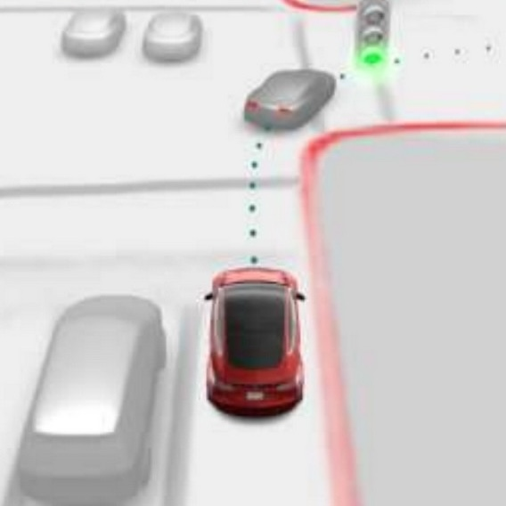

# Birds-eye view

Tesla's birds-eye feature is a top down projection of the cameras and some 3D rendering. 

I'm curious how to make that same effect and how far can I push it with home cameras and an Orin computer.
